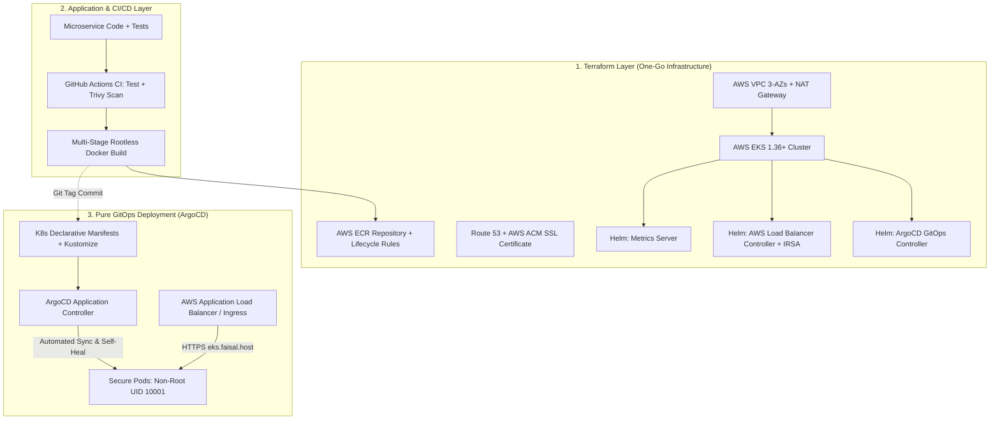

# 🚀 Complete Enterprise EKS DevSecOps & GitOps Platform

[](https://eks.faisal.host)
[](https://argoproj.github.io/cd/)
[](https://www.terraform.io/)
[](https://kubernetes.io/)
[-ff9900?style=for-the-badge&logo=amazon-aws&logoColor=white)](https://aws.amazon.com/eks/)
[](https://www.aquasec.com/products/trivy/)
[-2496ed?style=for-the-badge&logo=docker&logoColor=white)](https://www.docker.com/)

A production-grade, all-in-one **Cloud Native Enterprise Platform** that unites **Terraform Infrastructure as Code (One-Go Apply)**, **In-Cluster Day-1 Addons (Metrics Server, AWS Load Balancer Controller, ArgoCD)**, **Shift-Left DevSecOps (Aqua Trivy)**, and **Pure GitOps Continuous Delivery** with automated HTTPS routing on AWS EKS.

> 🌐 **Interactive Learning Paths / مبدّل اللغات / भाषा चुनें**:  
> [🇬🇧 English Master Guide](docs/LEARNING_PATH.md) • [🇮🇳 Hinglish गाइड (सरल भाषा)](docs/LEARNING_PATH.hi.md) • [🇸🇦 الدليل العربي الشامل للمؤسسات](docs/LEARNING_PATH.ar.md)

---

## 🏛️ Architecture & End-to-End Flow



---

## 📂 Repository Structure

```text
complete-eks-devsecops-platform/
├── .github/
│   └── workflows/
│       ├── 01-terraform-infra.yml      # Automated IaC CI/CD (tfsec, fmt, plan, apply)
│       └── 02-app-ci-cd.yml            # App DevSecOps CI/CD (lint, test, buildx, trivy, gitops commit)
├── terraform/                          # "One-Go Apply" Modular Infrastructure
│   ├── modules/
│   │   ├── vpc/                        # 3-AZ VPC, subnets, IGW, NAT Gateway
│   │   ├── eks/                        # EKS 1.36, Node Groups, KMS encryption, OIDC provider
│   │   ├── ecr/                        # ECR repo with scan-on-push & 10-image lifecycle policy
│   │   ├── route53-acm/                # Route 53 subdomain + ACM SSL cert + auto-validation
│   │   └── cluster-addons/             # Helm: Metrics Server, AWS LBC (IRSA), ArgoCD
│   ├── main.tf
│   ├── variables.tf
│   ├── outputs.tf
│   ├── versions.tf
│   └── terraform.tfvars.example
├── app/                                # Production Microservice
│   ├── Dockerfile                      # Multi-stage, Minimal, Non-Root UID 10001
│   ├── app.py                         # Telemetry portal (/healthz, /readyz, /metrics)
│   ├── requirements.txt
│   ├── requirements-dev.txt
│   ├── templates/index.html
│   └── tests/test_app.py
├── gitops/                             # Pure GitOps Declarative Manifests
│   ├── argocd/                         # ArgoCD Application CRD
│   │   └── application.yaml
│   └── apps/portal/                    # Kustomize base: Deployment, Ingress (ALB), HPA, PDB
│       ├── deployment.yaml
│       ├── service.yaml
│       ├── ingress.yaml
│       ├── hpa.yaml
│       ├── pdb.yaml
│       └── kustomization.yaml
├── docs/                               # Tri-Lingual Educational Master Guides
│   ├── LEARNING_PATH.md                # 🇬🇧 English
│   ├── LEARNING_PATH.hi.md             # 🇮🇳 Hinglish
│   └── LEARNING_PATH.ar.md             # 🇸🇦 العربية
└── README.md
```

---

## 🚀 Quickstart Guide (One-Go Deployment)

### 1. Provision Entire Infrastructure with Terraform
```bash
cd terraform
cp terraform.tfvars.example terraform.tfvars
# Update variables if needed (e.g. domain_name = "faisal.host", subdomain = "eks.faisal.host")

terraform init
terraform plan
terraform apply -auto-approve
```

### 2. Configure kubectl Access
```bash
aws eks update-kubeconfig --region ap-south-1 --name complete-eks-platform
```

### 3. Deploy the GitOps Application via ArgoCD
```bash
kubectl apply -f gitops/argocd/application.yaml
```

### 4. Access the Live Application
Open your browser at:
👉 **[https://eks.faisal.host](https://eks.faisal.host)**

---

### 💥 5. One-Go Total Wipeout (Zero Cost Teardown)
When you want to completely clean up every single AWS resource in one click with **0 orphan resources and 0 residual billing**:

#### Option A: Via GitHub Actions (Recommended)
1. Go to **Actions ➜ `01: Terraform Infrastructure Pipeline` ➜ Run workflow**
2. Choose **`destroy`** from the action dropdown and click **Run workflow**.
3. The pipeline will:
   - Clean up in-cluster Ingress & trigger AWS ALB deprovisioning.
   - Run `terraform destroy` across all modules (ECR with `force_delete`).
   - Wipe out the S3 state bucket and DynamoDB lock table for a 100% clean account.

#### Option B: Via Local Terminal
```bash
./scripts/teardown.sh
```

---

## 🛡️ Key Enterprise Features

1. **"One-Go Apply" Infrastructure**: A single `terraform apply` provisions AWS VPC, EKS 1.36, ECR, Route 53, ACM SSL certificate, and deploys Metrics Server, AWS Load Balancer Controller, and ArgoCD automatically.
2. **Pure GitOps (Pull vs Push)**: ArgoCD runs inside the cluster, watching `gitops/apps/portal`. If manual drift occurs, ArgoCD self-heals within 30 seconds.
3. **Hardened DevSecOps**:
   - Multi-stage Docker running as unprivileged `UID 10001`.
   - In-line Aqua Trivy security scanner blocks builds with `CRITICAL` CVEs.
   - `tfsec` scans Terraform code for cloud misconfigurations.
4. **Cloud-Native Resilience**:
   - Zero-downtime rolling update strategy (`maxSurge: 25%`, `maxUnavailable: 0`).
   - PodDisruptionBudget ensures minimum availability during maintenance.
   - Horizontal Pod Autoscaler (HPA) scales dynamically between 2 and 10 replicas.
5. **Production Ingress & SSL**:
   - Real AWS Application Load Balancer managed by AWS Load Balancer Controller.
   - Automatic HTTP-to-HTTPS redirect with valid Amazon ACM certificate.

---

## 📚 Tri-Lingual Master Guides
- 🇬🇧 **[English Master Guide](docs/LEARNING_PATH.md)**
- 🇮🇳 **[Hinglish Mastery Path (सरल भाषा)](docs/LEARNING_PATH.hi.md)**
- 🇸🇦 **[الدليل العربي الشامل للمؤسسات](docs/LEARNING_PATH.ar.md)**

---

**Author**: [Faisal Ansari](https://faisal.host) • [LinkedIn](https://www.linkedin.com/in/clumsyfaisal/)
