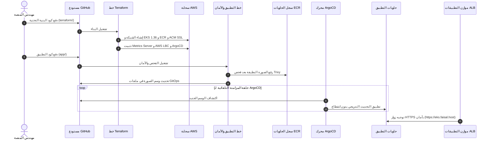

# 🎓 منصة EKS DevSecOps و GitOps للمؤسسات: الدليل التعليمي الشامل

> 🌐 **Language Selector / مبدّل اللغات / भाषा चुनें**:  
> [🇬🇧 English](LEARNING_PATH.md) • [🇮🇳 Hinglish](LEARNING_PATH.hi.md) • **[🇸🇦 العربية (الحالي)]**

> **المؤلف**: [فيصل أنصاري (Faisal Ansari)](https://faisal.host) • [LinkedIn](https://www.linkedin.com/in/clumsyfaisal/)  
> **السحابة المستهدفة**: AWS (`ap-south-1` مومباي)  
> **إدارة الحاويات**: Kubernetes على AWS EKS (`1.36+`)  
> **محرك GitOps**: أداة ArgoCD مع المزامنة التلقائية والاسترجاع الذاتي  
> **البنية التحتية ككود**: Terraform بنمط التطبيق الكامل دفعة واحدة (One-Go Apply)  
> **نقطة النهاية العامة**: [https://eks.faisal.host](https://eks.faisal.host)

---

## 📑 جدول المحتويات
1. [المفاهيم الأساسية: تطور النشر السحابي (ClickOps -> IaC -> GitOps)](#1-المفاهيم-الأساسية-تطور-النشر-السحابي)
2. [المخطط المعماري الكامل وتدفق البيانات](#2-المخطط-المعماري-الكامل-وتدفق-البيانات)
3. [محرك Terraform ونمط التطبيق الكامل دفعة واحدة](#3-محرك-terraform-ونمط-التطبيق-الكامل-دفعة-واحدة)
4. [الإضافات التشغيلية المدمجة: Metrics Server و AWS LBC و ArgoCD](#4-الإضافات-التشغيلية-المدمجة)
5. [أمن الحاويات وفحص الثغرات مع Aqua Trivy](#5-أمن-الحاويات-وفحص-الثغرات-مع-aqua-trivy)
6. [التسليم بنمط GitOps النقي عبر ArgoCD](#6-التسليم-بنمط-gitops-النقي-عبر-argocd)
7. [التحصين الإنتاجي: PDB و HPA والمستخدم غير المميز (UID 10001)](#7-التحصين-الإنتاجي)
8. [التشفير التلقائي: Route 53 وشهادات ACM SSL](#8-التشفير-التلقائي)
9. [دليل التشغيل العملي واختبارات الضغط](#9-دليل-التشغيل-العملي-واختبارات-الضغط)
10. [أهم 20 سؤالاً وجواباً في مقابلات وظائف Platform Engineer و SRE](#10-أهم-20-سؤالاً-وجواباً-في-مقابلات-الوظائف)

---

## 1. المفاهيم الأساسية: تطور النشر السحابي

1. **النشر اليدوي (ClickOps)**: كان يتم عبر لوحة التحكم يدوياً مما يسبب أخطاء بشرية وصعوبة في إعادة البناء.
2. **البنية التحتية ككود (Terraform)**: يتم تعريف كل الخوادم والشبكات برمجياً في ملفات نصية منظمة.
3. **نمط GitOps النقي (ArgoCD)**: نظام مراقبة يعمل داخل EKS يراقب مستودع Git كمصدر وحيد للحقيقة، ويصلح أي انحراف تلقائياً (**Self-Healing**).

---

## 2. المخطط المعماري الكامل وتدفق البيانات

---

## 3. محرك Terraform ونمط التطبيق الكامل دفعة واحدة

تم تقسيم ملفات Terraform إلى وحدات مستقلة:
- **`modules/vpc`**: شبكة عبر 3 مناطق توفر وبوابات NAT.
- **`modules/eks`**: مجموعة EKS 1.36 وتشفير أسرار KMS ومزود OIDC.
- **`modules/ecr`**: سجل حاويات مشفر ومفحوص أمنياً تلقائياً مع الاحتفاظ بآخر 10 صور فقط.
- **`modules/route53-acm`**: طلب شهادة SSL للنطاق `eks.faisal.host` وتوثيقها تلقائياً.
- **`modules/cluster-addons`**: تثبيت خادم القياسات وموازن الأحمال وأداة ArgoCD عبر مزود Helm المدمج.

---

## 4. الإضافات التشغيلية المدمجة

- **Metrics Server**: لتمكين التحجيم التلقائي للأحمال الحية (HPA).
- **AWS Load Balancer Controller**: لإدارة موازنات التطبيقات (ALB) وتوجيه حركة المرور مباشرة لعناوين IP الحاويات.
- **ArgoCD**: لتطبيق التزامن التلقائي ومنع التعديل اليدوي في بيئة الإنتاج.
