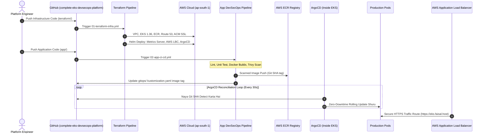

# 🎓 Enterprise EKS DevSecOps & GitOps Platform: Mastery Guide (Hinglish)

> 🌐 **Language Selector / مبدّل اللغات / भाषा चुनें**:  
> [🇬🇧 English](LEARNING_PATH.md) • **[🇮🇳 Hinglish (वर्तमान)]** • [🇸🇦 العربية](LEARNING_PATH.ar.md)

> **Author**: [Faisal Ansari](https://faisal.host) • [LinkedIn](https://www.linkedin.com/in/clumsyfaisal/)  
> **Target Cloud**: AWS (`ap-south-1` Mumbai)  
> **Orchestration**: Kubernetes on AWS EKS (`1.36+`)  
> **GitOps Engine**: ArgoCD with Automated Sync & Self-Healing  
> **Infrastructure as Code**: Terraform "One-Go Apply" (VPC, EKS, ECR, Route 53, ACM SSL, Helm Addons)  
> **Public HTTPS Endpoint**: [https://eks.faisal.host](https://eks.faisal.host)

---

## 📑 Table of Contents
1. [Scratch Se Samajhte Hain: ClickOps Se GitOps Tak Ka Safar](#1-scratch-se-samajhte-hain-clickops-se-gitops-tak-ka-safar)
2. [End-to-End Enterprise Architecture Blueprint](#2-end-to-end-enterprise-architecture-blueprint)
3. [Terraform "One-Go Apply" Engine Ka Deep Dive](#3-terraform-one-go-apply-engine-ka-deep-dive)
4. [In-Cluster Day-1 Addons: Metrics Server, AWS LBC aur ArgoCD](#4-in-cluster-day-1-addons-metrics-server-aws-lbc-aur-argocd)
5. [Microservice DevSecOps: Dockerfile aur Aqua Trivy Scanning](#5-microservice-devsecops-dockerfile-aur-aqua-trivy-scanning)
6. [Pure GitOps: ArgoCD State Kaise Manage Karta Hai?](#6-pure-gitops-argocd-state-kaise-manage-karta-hai)
7. [Production Hardening: PDB, HPA aur Non-Root UID 10001](#7-production-hardening-pdb-hpa-aur-non-root-uid-10001)
8. [Automated HTTPS: Route 53 aur ACM SSL Architecture](#8-automated-https-route-53-aur-acm-ssl-architecture)
9. [Hands-On Runbook aur Stress Testing Playbook](#9-hands-on-runbook-aur-stress-testing-playbook)
10. [Top 20 Platform Engineer & SRE Interview Q&A](#10-top-20-platform-engineer--sre-interview-qa)
11. [Zero-Cost Clean Teardown: "One-Go Total Wipeout" Architecture](#11-zero-cost-clean-teardown-one-go-total-wipeout-architecture)
12. [Real-World Troubleshooting: Helm Key Parsing Error with Commas](#12-real-world-troubleshooting-helm-key-parsing-error-with-commas)

---

## 1. Scratch Se Samajhte Hain: ClickOps Se GitOps Tak Ka Safar

Agar aap bilkul shuruat se sikh rahe hain, toh samajhte hain ki industry me deployment kaise evolve hui:

### 1. ClickOps (Purana Tareeka)
AWS Web Console me jakar buttons click karke EC2, VPC ya EKS banana.
- **Nuksan**: Human error, koi track record nahi, aur doosra environment banana bohot mushkil.

### 2. Infrastructure as Code (Terraform)
Code file (`.tf`) me likh kar ek command se poora AWS setup banana.
- **Fayda**: Automated, repeatable, aur audit trail.

### 3. Pure GitOps (ArgoCD)
Pehle CI/CD runner cluster ke andar push karta tha. Lekin **GitOps** me cluster ke andar baitha **ArgoCD agent** Git repo ko har 30 seconds me monitor karta hai. Agar kisi ne production me galti se pod delete kiya ya badla, toh ArgoCD use turant pakad kar Git wale version par wapas le aata hai (**Self-Healing**).

---

## 2. End-to-End Enterprise Architecture Blueprint



---

## 3. Terraform "One-Go Apply" Engine Ka Deep Dive

Pehle hume bohot se kaam manual karne padte the. Is naye project me Terraform **ek single apply** me sab kuch setup kar deta hai:
1. **`modules/vpc`**: 3 Availability Zones, Public subnets (ALB ke liye), Private subnets (Worker nodes ke liye), NAT Gateway aur IGW.
2. **`modules/eks`**: EKS v1.36 Cluster, KMS Secret Encryption, Managed Node Groups (`t3.medium`), aur OIDC Provider (IRSA ke liye).
3. **`modules/ecr`**: Private registry with automatic vulnerability scan on push aur 10-image lifecycle policy (AWS cost control).
4. **`modules/route53-acm`**: Route 53 me `eks.faisal.host` ke liye ACM SSL certificate create aur auto-validate karta hai.
5. **`modules/cluster-addons`**: Terraform ke Helm provider se cluster bante hi Metrics Server, AWS Load Balancer Controller aur ArgoCD auto-install kar deta hai!

---

## 4. In-Cluster Day-1 Addons: Metrics Server, AWS LBC aur ArgoCD

### A. Metrics Server (HPA Fix)
Node kubelet se CPU aur Memory data collect karta hai taaki Autoscaling (HPA) real metrics dekh sake.

### B. AWS Load Balancer Controller (LBC)
Yeh controller Ingress resource dekhte hi AWS me real Application Load Balancer (ALB) banata hai aur pods ke IP direct target group me jodta hai.

### C. ArgoCD
GitOps engine jo continuous delivery aur zero-drift policy enforce karta hai.

---

## 5. Microservice DevSecOps: Dockerfile aur Aqua Trivy Scanning

### Multi-Stage Distroless Dockerfile
```dockerfile
# Stage 1: Build & Dependencies
FROM python:3.11-slim AS builder
WORKDIR /build
COPY requirements.txt .
RUN pip install --user --no-cache-dir -r requirements.txt

# Stage 2: Minimal Runtime
FROM python:3.11-slim
WORKDIR /app
RUN groupadd -g 10001 appgroup && useradd -u 10001 -g appgroup appuser
COPY --from=builder /root/.local /home/appuser/.local
COPY . /app/
USER 10001:10001
```
- **Non-Root User (`UID 10001`)**: Hacker agar container hack bhi kar le, toh bhi woh AWS host server par root nahi ban sakta.
- **Aqua Trivy Scan**: CI stage me hi CRITICAL aur HIGH vulnerabilities ko block kar deta hai (Shift-Left Security).

---

## 6. Pure GitOps: ArgoCD State Kaise Manage Karta Hai?

In [gitops/argocd/application.yaml](file:///Users/deadpool/Documents/Project/complete-eks-devsecops-platform/gitops/argocd/application.yaml):
- `selfHeal: true`: Agar koi cluster me manual changes karega, toh ArgoCD turant use reject karke Git ke original state par restore kar dega.
- `prune: true`: Agar Git se koi file delete hui, toh cluster se bhi safely remove ho jayegi.

---

## 7. Production Hardening: PDB, HPA aur Non-Root UID 10001

- **Zero-Downtime Rolling Update**: `maxUnavailable: 0` ensure karta hai ki purane pods tab tak nahi band honge jab tak naye pods `/readyz` pass na kar lein.
- **PodDisruptionBudget (PDB)**: `minAvailable: 1` ensure karta hai ki node upgrade ya maintenance ke dauraan service kabhi down na ho.
- **Horizontal Pod Autoscaler (HPA)**: CPU 70% ya Memory 80% cross hote hi pods automatically 2 se 10 scale ho jate hain.

---

## 8. Automated HTTPS: Route 53 aur ACM SSL Architecture

- Ingress annotations se HTTP (Port 80) automatically HTTPS (Port 443) par redirect ho jata hai.
- AWS ALB trusted Amazon SSL certificate use karta hai jisse browser me green padlock 🔒 dikhta hai.

---

## 9. Hands-On Runbook aur Stress Testing Playbook

```bash
# Addons pods verify karein
kubectl get pods -n kube-system
kubectl get pods -n argocd

# Live resource consumption check karein
kubectl top nodes
kubectl top pods -n production
kubectl get hpa -n production

# High-traffic stress test run karein
kubectl run load-generator --rm -i --tty --image=busybox --restart=Never -- /bin/sh -c "while sleep 0.01; do wget -q -O- http://complete-eks-portal-service.production.svc.cluster.local:80; done"
```

---

## 10. Top 20 Platform Engineer & SRE Interview Q&A

1. **GitOps Push vs Pull Model me kya farak hai?**
   Push model me CI runner ke paas cluster admin credentials hote hain. Pull model (ArgoCD) me agent cluster ke andar baith kar Git se pull karta hai, credentials kabhi bahar leak nahi hote.

2. **AWS Load Balancer Controller ka kya faayda hai?**
   Yeh Layer 7 Application Load Balancers (ALB) banata hai aur pods ke IP directly target groups me map karta hai, jisse latency kam hoti hai.

3. **HPA ka mathematical formula kya hai?**
   $$\text{Desired Replicas} = \left\lceil \text{Current Replicas} \times \left( \frac{\text{Current Metric}}{\text{Target Metric}} \right) \right\rceil$$

---

## 11. Zero-Cost Clean Teardown: "One-Go Total Wipeout" Architecture

Enterprise DevOps me infrastructure create karne jitna hi important use **cleanly teardown** karna hota hai taaki cloud me koi hidden cost ya orphan resources na bachein.

### ❓ Teardown me common challenges kya aate hain?
1. **Orphan ALBs & Subnet Dependency Violation**: Jab hum Ingress banate hain, toh AWS Load Balancer Controller AWS me ek Application Load Balancer aur ENIs create karta hai. Agar hum direct Terraform destroy chalayenge toh VPC delete nahi hogi (`DependencyViolation: Subnet has active interfaces`).
2. **ECR Repository Non-Empty Error**: Agar ECR me images pushed hain toh AWS repo delete karne se mana kar deta hai (`RepositoryNotEmptyException`).
3. **State Loss on Ephemeral Runners**: GitHub Actions ke ephemeral runners par agar state local ho toh runner khatam hone par state gayab ho jati hai.

### 💡 Hamara Built-In Solution:
- **Pre-Clean Step**: Teardown hone se pehle K8s Ingress ko delete karke AWS ALB ke deprovision hone ka 30s wait kiya jata hai.
- **ECR `force_delete = true`**: Images ke bawajood repository safely delete hoti hai.
- **Automated S3 & DynamoDB Wipeout**: Saare compute resources delete hone ke baad S3 backend bucket aur DynamoDB table ko bhi permanently wipe out kar diya jata hai taaki account 100% clean aur ₹0 billing par aa jaye!
- **GitHub Actions One-Click**: Sirf `01: Terraform Infrastructure Pipeline` me `action: destroy` select karke run karna hota hai!

---

## 12. Real-World Troubleshooting: Helm Key Parsing Error with Commas

Production pipelines me aane wale issues ko samajhna aur document karna bohot zaroori hota hai taaki future me same problem aane par time waste na ho.

### 🚨 Actual Pipeline Error (From Live Run):
```text
Error: failed parsing key "args[0]" with value --kubelet-preferred-address-types=InternalIP,ExternalIP,Hostname, key "ExternalIP" has no value (cannot end with ,)
with module.cluster_addons.helm_release.metrics_server,
on modules/cluster-addons/main.tf line 2, in resource "helm_release" "metrics_server":
  2: resource "helm_release" "metrics_server" {
```

### 🔍 Root Cause Analysis (Problem Kyun Aayi?):
1. Terraform ke `helm_release` resource me jab hum `set` block use karte hain:
   ```hcl
   # ❌ PROBLEM: Helm parses comma as a list delimiter
   set {
     name  = "args[0]"
     value = "--kubelet-preferred-address-types=InternalIP,ExternalIP,Hostname"
   }
   ```
2. Helm CLI internally `--set key=value1,value2` ko split karta hai. Jab Helm ne dekha ki `InternalIP,` ke baad comma hai, usne socha ki yeh multiple keys hain, aur parse error throw kar diya (`key ExternalIP has no value`).

### 🛠️ Industry Best Practice Solution (`yamlencode`):
Terraform me Helm values pass karne ka sabse solid aur professional tareeqa **`values = [yamlencode({...})]`** hota hai. Yeh raw strings ke parsing bugs ko 100% khatam kar deta hai:

```hcl
# ✅ SOLUTION: Pure YAML serialization
resource "helm_release" "metrics_server" {
  name       = "metrics-server"
  repository = "https://kubernetes-sigs.github.io/metrics-server/"
  chart      = "metrics-server"
  version    = "3.12.2"
  namespace  = "kube-system"

  values = [
    yamlencode({
      args = [
        "--kubelet-preferred-address-types=InternalIP,ExternalIP,Hostname"
      ]
    })
  ]
}
```

### 🎯 Verification:
Fix apply karte hi metrics-server live deploy ho gaya:
```bash
$ kubectl top nodes
NAME                                         CPU(cores)   CPU(%)   MEMORY(bytes)   MEMORY(%)   
ip-10-0-12-225.ap-south-1.compute.internal   25m          1%       564Mi           17%         
ip-10-0-13-70.ap-south-1.compute.internal    57m          2%       752Mi           22%
```
Ab HPA ko real-time CPU/RAM consumption data milna shuru ho chuka hai!


