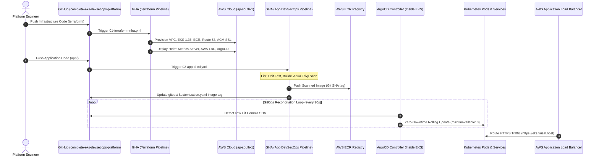

# 🎓 Enterprise EKS DevSecOps & GitOps Platform: Complete Mastery Guide

> 🌐 **Language Selector / مبدّل اللغات / भाषा चुनें**:  
> **[🇬🇧 English (Current)]** • [🇮🇳 Hinglish](LEARNING_PATH.hi.md) • [🇸🇦 العربية](LEARNING_PATH.ar.md)

> **Author**: [Faisal Ansari](https://faisal.host) • [LinkedIn](https://www.linkedin.com/in/clumsyfaisal/)  
> **Target Cloud**: AWS (`ap-south-1` Mumbai)  
> **Orchestration**: Kubernetes on AWS EKS (`1.36+`)  
> **GitOps Engine**: ArgoCD with Automated Reconciliation & Self-Healing  
> **Infrastructure as Code**: Terraform "One-Go Apply" (VPC, EKS, ECR, Route 53, ACM SSL, Helm Addons)  
> **Public HTTPS Endpoint**: [https://eks.faisal.host](https://eks.faisal.host)

---

## 📑 Table of Contents
1. [Foundations: The Evolution of Cloud Delivery (ClickOps -> IaC -> GitOps)](#1-foundations-the-evolution-of-cloud-delivery)
2. [End-to-End Enterprise Architecture & Data Flow](#2-end-to-end-enterprise-architecture--data-flow)
3. [Terraform "One-Go Apply" Engine Deep Dive](#3-terraform-one-go-apply-engine-deep-dive)
4. [In-Cluster Day-1 Addons: Metrics Server, AWS Load Balancer Controller & ArgoCD](#4-in-cluster-day-1-addons)
5. [Microservice Engineering & DevSecOps Scanning (Dockerfile & Aqua Trivy)](#5-microservice-engineering--devsecops-scanning)
6. [Pure GitOps Delivery: How ArgoCD Manages State](#6-pure-gitops-delivery-how-argocd-manages-state)
7. [Kubernetes Manifests & Production Hardening (PDB, HPA, Non-Root UID 10001)](#7-kubernetes-manifests--production-hardening)
8. [Automated HTTPS: Route 53 & ACM SSL Architecture](#8-automated-https-route-53--acm-ssl-architecture)
9. [Hands-On Operational Runbook & Stress Testing Playbook](#9-hands-on-operational-runbook--stress-testing-playbook)
10. [Top 20 Platform Engineer & SRE Interview Questions & Answers](#10-top-20-platform-engineer--sre-interview-questions--answers)
11. [Zero-Cost Clean Teardown: "One-Go Total Wipeout" Architecture](#11-zero-cost-clean-teardown-one-go-total-wipeout-architecture)
12. [Real-World Troubleshooting: Helm Key Parsing Error with Commas](#12-real-world-troubleshooting-helm-key-parsing-error-with-commas)
13. [Python CI/CD Troubleshooting: Module vs Package Shadowing in Unittest](#13-python-cicd-troubleshooting-module-vs-package-shadowing-in-unittest)

---

## 1. Foundations: The Evolution of Cloud Delivery

### Phase 1: ClickOps (Manual Web Console)
Engineers manually created resources in the AWS Web Console.  
- **Disadvantages**: Human misconfiguration, zero reproducibility, configuration drift, and impossible disaster recovery.

### Phase 2: Infrastructure as Code (Terraform)
Infrastructure defined as declarative `.tf` files. Terraform maintains state and calculates exact dependency graphs.  
- **Advantage**: Version controlled, auditable, and automated.

### Phase 3: Pure GitOps (ArgoCD & Kubernetes)
Instead of an external pipeline having admin access into the cluster, a controller **inside** Kubernetes continuously watches Git as the **Single Source of Truth**. If someone manually edits a pod or service in production, ArgoCD detects the drift and automatically restores the desired state (**Self-Healing**).

---

## 2. End-to-End Enterprise Architecture & Data Flow



---

## 3. Terraform "One-Go Apply" Engine Deep Dive

Our modular Terraform codebase provisions the entire stack in one command without manual intervention:
1. **`modules/vpc`**: 3 Availability Zones, 3 Public Subnets (tagged `kubernetes.io/role/elb = 1`), 3 Private Subnets (tagged `kubernetes.io/role/internal-elb = 1`), NAT Gateway, Internet Gateway, and Route Tables.
2. **`modules/eks`**: EKS v1.36 Control Plane with KMS secret envelope encryption, managed node groups (`t3.medium`), and IAM OpenID Connect (OIDC) provider for IRSA.
3. **`modules/ecr`**: Private container registry with scan-on-push and lifecycle rules retaining only the last 10 images to minimize AWS storage costs.
4. **`modules/route53-acm`**: Fully codified SSL certificate request for `eks.faisal.host` with automatic DNS validation records in Route 53.
5. **`modules/cluster-addons`**: Uses Terraform's `helm_release` provider to install core controllers immediately after the cluster is created.

---

## 4. In-Cluster Day-1 Addons

### A. Kubernetes Metrics Server
Scrapes CPU/Memory from node `kubelet` cAdvisors. Without Metrics Server, Horizontal Pod Autoscaling (HPA) fails with `<unknown>` metrics.

### B. AWS Load Balancer Controller (LBC)
Instead of classic in-tree load balancers, AWS LBC natively creates AWS Application Load Balancers (ALBs) when Kubernetes `Ingress` resources are created, and registers Pod IPs directly (Target Type: `ip`).

### C. ArgoCD GitOps Engine
Deploys the declarative GitOps operator in the `argocd` namespace. ArgoCD monitors `gitops/apps/portal` and synchronizes Kubernetes workloads automatically.

---

## 5. Microservice Engineering & DevSecOps Scanning

### Multi-Stage Distroless Dockerfile
```dockerfile
# Stage 1: Build Dependencies
FROM python:3.11-slim AS builder
WORKDIR /build
COPY requirements.txt .
RUN pip install --user --no-cache-dir -r requirements.txt

# Stage 2: Minimal Runtime
FROM python:3.11-slim
WORKDIR /app
RUN groupadd -g 10001 appgroup && useradd -u 10001 -g appgroup appuser
COPY --from=builder /root/.local /home/appuser/.local
COPY . /app/
USER 10001:10001
```
- **Why UID 10001?**: Containers running as root (`UID 0`) expose the host node to kernel privilege escalation and container breakout exploits.
- **Aqua Trivy Scanning**: Scans OS packages and application dependencies for CVEs during CI.

---

## 6. Pure GitOps Delivery: How ArgoCD Manages State

In [gitops/argocd/application.yaml](file:///Users/deadpool/Documents/Project/complete-eks-devsecops-platform/gitops/argocd/application.yaml):
- `automated.selfHeal = true`: If an engineer runs `kubectl delete pod` or modifies replicas via CLI, ArgoCD restores the Git configuration within seconds.
- `automated.prune = true`: If a resource is deleted from Git, ArgoCD cleanly garbage-collects it from the cluster.

---

## 7. Kubernetes Manifests & Production Hardening

- **Zero-Downtime Rolling Update**: `maxSurge: 25%` and `maxUnavailable: 0` ensures capacity never drops below 100%.
- **PodDisruptionBudget (PDB)**: `minAvailable: 1` ensures node maintenance or EKS version upgrades never take down the service.
- **Horizontal Pod Autoscaler (HPA)**: Scales from 2 to 10 replicas when CPU exceeds 70% or Memory exceeds 80%.

---

## 8. Automated HTTPS: Route 53 & ACM SSL Architecture

- Ingress annotations:
  ```yaml
  alb.ingress.kubernetes.io/listen-ports: '[{"HTTP": 80}, {"HTTPS": 443}]'
  alb.ingress.kubernetes.io/ssl-redirect: '443'
  ```
- AWS Application Load Balancer terminates TLS on port 443 using the ACM certificate for `eks.faisal.host` and automatically redirects all HTTP port 80 traffic to HTTPS.

---

## 9. Hands-On Operational Runbook & Stress Testing Playbook

### View In-Cluster Controllers & Metrics
```bash
# Verify Metrics Server and AWS Load Balancer Controller
kubectl get pods -n kube-system

# Verify ArgoCD Controller
kubectl get pods -n argocd

# Check live resource metrics
kubectl top nodes
kubectl top pods -n production
kubectl get hpa -n production
```

### Run Real-Time Autoscaling Stress Test
```bash
# Terminal 1: Watch HPA scale
kubectl get hpa -n production -w

# Terminal 2: Generate continuous load
kubectl run load-generator --rm -i --tty --image=busybox --restart=Never -- /bin/sh -c "while sleep 0.01; do wget -q -O- http://complete-eks-portal-service.production.svc.cluster.local:80; done"
```

---

## 10. Top 20 Platform Engineer & SRE Interview Questions & Answers

1. **What is GitOps and how does it differ from traditional CI/CD push pipelines?**
   In traditional CI/CD, the runner pushes changes into Kubernetes using admin credentials. In GitOps, an agent inside the cluster (ArgoCD) pulls changes from Git. Credentials never leave the cluster, and automatic drift detection ensures self-healing.

2. **Why use AWS Load Balancer Controller instead of in-tree Service type LoadBalancer?**
   AWS LBC supports modern ALBs (Layer 7 routing, path routing, AWS WAF, ACM SSL termination) and targets Pod IPs directly, bypassing `kube-proxy` hops.

3. **What is the mathematical formula behind HPA?**
   $$\text{Desired Replicas} = \left\lceil \text{Current Replicas} \times \left( \frac{\text{Current Metric}}{\text{Target Metric}} \right) \right\rceil$$

4. **Why are non-root containers (`UID 10001`) mandatory in production?**
   If an RCE vulnerability is exploited, running as root gives the attacker root permissions on the host node kernel. Non-root users mitigate container breakout vulnerabilities.

5. **How does IAM Roles for Service Accounts (IRSA) work?**
   IRSA uses OIDC federated authentication to exchange Kubernetes service account tokens for temporary AWS STS credentials, adhering to least privilege.

---

## 11. Zero-Cost Clean Teardown: "One-Go Total Wipeout" Architecture

In production cloud engineering, clean deprovisioning is just as vital as provisioning to ensure zero residual costs and no orphaned resources.

### ❓ Common Teardown Pitfalls:
1. **Orphan ALBs & Subnet Dependency Violations**: When Kubernetes Ingress provisions an AWS ALB, the ALB and its ENIs reside inside the VPC subnets. If `terraform destroy` executes directly, the VPC cannot be destroyed (`DependencyViolation: Subnet has active interfaces`).
2. **ECR Repository Non-Empty Error**: If container images exist in ECR, AWS blocks repository deletion (`RepositoryNotEmptyException`).
3. **State Loss on Ephemeral CI Runners**: Ephemeral GitHub runners lose local `.tfstate` files after workflow execution, leaving cloud resources unmanageable.

### 💡 The Complete Platform Solution:
- **Pre-Clean Step**: Teardown automatically runs `kubectl delete ingress --all` and waits 30 seconds for AWS Load Balancer Controller to deprovision the ALB before Terraform touches the VPC.
- **ECR `force_delete = true`**: Enables clean repository deletion regardless of image count.
- **State Persistence with S3 & DynamoDB**: Encrypted remote backend guarantees state durability across all workflow runs.
- **Automated Backend Wipeout**: Once all infrastructure is destroyed, the S3 state bucket and DynamoDB table are permanently deleted, leaving an absolute **$0.00 AWS footprint**.

---

## 12. Real-World Troubleshooting: Helm Key Parsing Error with Commas

### 🚨 The Error Encountered:
```text
Error: failed parsing key "args[0]" with value --kubelet-preferred-address-types=InternalIP,ExternalIP,Hostname, key "ExternalIP" has no value (cannot end with ,)
with module.cluster_addons.helm_release.metrics_server,
on modules/cluster-addons/main.tf line 2, in resource "helm_release" "metrics_server":
  2: resource "helm_release" "metrics_server" {
```

### 🔍 Root Cause Analysis:
When using Terraform's `helm_release` with the `set` block:
```hcl
# ❌ Anti-pattern: String with commas gets parsed as multiple CLI keys
set {
  name  = "args[0]"
  value = "--kubelet-preferred-address-types=InternalIP,ExternalIP,Hostname"
}
```
Helm CLI interprets commas `,` inside a `set` string as delimiters separating multiple key-value pairs (`--set a=1,b=2`). When Helm encountered `InternalIP,ExternalIP`, it assumed `ExternalIP` was a new flag without a value.

### 🛠️ Production Solution (`yamlencode`):
Use Terraform's native `yamlencode` inside the `values` block. This bypasses string splitting and serializes clean YAML to Helm:
```hcl
# ✅ Best Practice: Native YAML serialization
resource "helm_release" "metrics_server" {
  name       = "metrics-server"
  repository = "https://kubernetes-sigs.github.io/metrics-server/"
  chart      = "metrics-server"
  version    = "3.12.2"
  namespace  = "kube-system"

  values = [
    yamlencode({
      args = [
        "--kubelet-preferred-address-types=InternalIP,ExternalIP,Hostname"
      ]
    })
  ]
}
```

### 🎯 Live Verification:
```bash
$ kubectl top nodes
NAME                                         CPU(cores)   CPU(%)   MEMORY(bytes)   MEMORY(%)   
ip-10-0-12-225.ap-south-1.compute.internal   25m          1%       564Mi           17%         
ip-10-0-13-70.ap-south-1.compute.internal    57m          2%       752Mi           22%
```

---

## 13. Python CI/CD Troubleshooting: Module vs Package Shadowing in Unittest

### 🚨 The Error Encountered:
```text
ERROR: test_healthz (test_app.TestApp.test_healthz)
Traceback (most recent call last):
  File "app/tests/test_app.py", line 6, in setUp
    self.client = app.test_client()
AttributeError: module 'app.app' has no attribute 'test_client'
```

### 🔍 Root Cause Analysis:
When running `python -m unittest discover -s app/tests` from the repository root:
1. `from app import app` creates namespace ambiguity: `app` is both the parent directory (a package) and `app.py` (a module).
2. Python imports the module `app.app` instead of the Flask application instance inside it.
3. The module object does not possess a `.test_client()` method, triggering an `AttributeError`.

### 🛠️ Production Solution:
1. Expose `app` in `app/__init__.py`:
   ```python
   from .app import app
   __all__ = ["app"]
   ```
2. Add defensive resolution in `test_app.py`:
   ```python
   if hasattr(app, 'app') and not hasattr(app, 'test_client'):
       app = app.app
   ```
This guarantees consistent imports regardless of whether tests execute from the root directory, subdirectories, or inside Docker containers.


